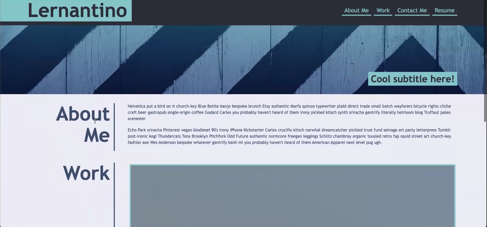
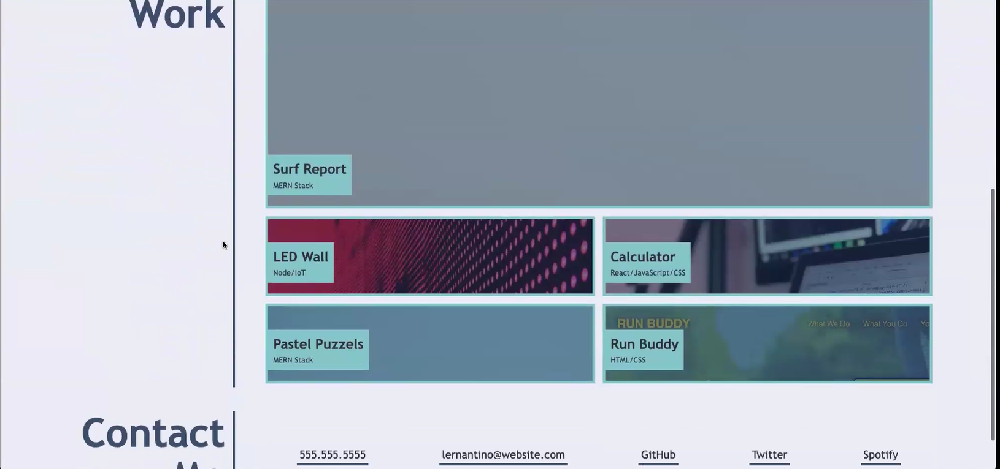
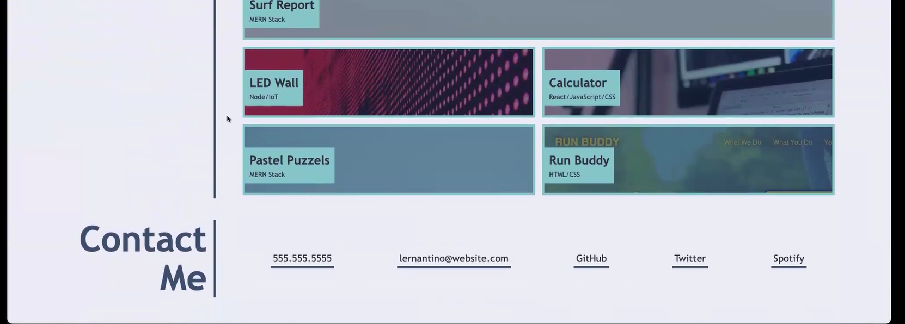

# CSS--My-Portfolio-HW2

# Description 
The motivation behind this project was to have students build a website portfolio from scratch and try to get better understanding of using different and put into practice HTML semantics and CSS tools to get your portfolio met multiple requirements. From these past sessions, we able to show what we've learned throughout the CSS and HTML and create our own functioning site. 

The goal in these homework was to create an online portfolio template matching the format of the one provided in the Module but at our own style.

# Reference 
Please see the reference below: 

There were a few challenges I faced when creating my online portfolio from nothing. Some of the challenges during this homework was trying to build the content-boxes for each of the future projects. I had to pay attention to every little details as sizes, numbers, pixels, text etc, that contains creating a website. This situation created a better understanding of each command for CSS. Developers have the opportunity to create and modify their website to improve the user experience and help others to make the website they desired for their business. For me, the hardest part of this homework was designing the CSS page and without any html references. I really look forward to make anmends to my portfolio based on the feedback provided once is being reviewed.

# Usage

The Users will be able to visit and explore within Yamil Hernandez's portfolio and allow them to see the work and improvement through the bootcamp experience. 

# Credits 

Kevin Fergunson - Bootcamp Instructor
Charlie Puente - TA
MD Mozilla 
www.w3schools.com 

